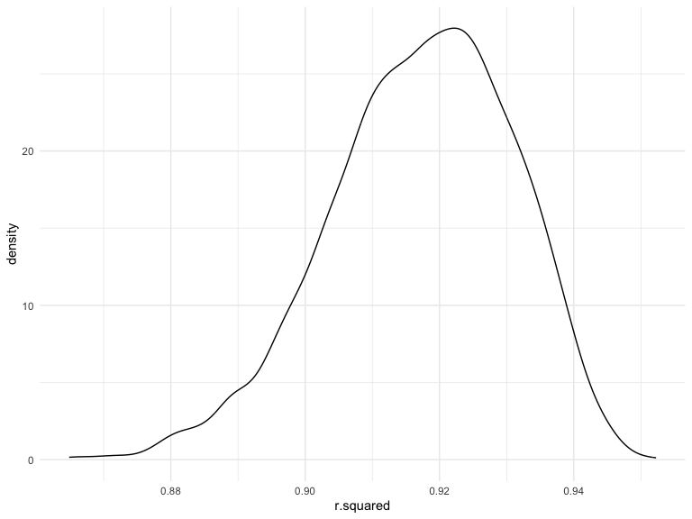

Homework 6
================
Wen Dai
2023-12-02

### Problem 1

In the data cleaning code below we create a `city_state` variable,
change `victim_age` to numeric, modifiy victim_race to have categories
white and non-white, with white as the reference category, and create a
`resolution` variable indicating whether the homicide is solved. Lastly,
we filtered out the following cities: Tulsa, AL; Dallas, TX; Phoenix,
AZ; and Kansas City, MO; and we retained only the variables
`city_state`, `resolution`, `victim_age`, `victim_sex`, and
`victim_race`.

``` r
homicide_df = 
  read_csv("data/homicide-data.csv", na = c("", "NA", "Unknown")) |> 
  mutate(
    city_state = str_c(city, state, sep = ", "),
    victim_age = as.numeric(victim_age),
    resolution = case_when(
      disposition == "Closed without arrest" ~ 0,
      disposition == "Open/No arrest"        ~ 0,
      disposition == "Closed by arrest"      ~ 1)
  ) |> 
  filter(victim_race %in% c("White", "Black")) |> 
  filter(!(city_state %in% c("Tulsa, AL", "Dallas, TX", "Phoenix, AZ", "Kansas City, MO"))) |> 
  select(city_state, resolution, victim_age, victim_sex, victim_race)
```

    ## Rows: 52179 Columns: 12
    ## ── Column specification ────────────────────────────────────────────────────────
    ## Delimiter: ","
    ## chr (8): uid, victim_last, victim_first, victim_race, victim_sex, city, stat...
    ## dbl (4): reported_date, victim_age, lat, lon
    ## 
    ## ℹ Use `spec()` to retrieve the full column specification for this data.
    ## ℹ Specify the column types or set `show_col_types = FALSE` to quiet this message.

Next we fit a logistic regression model using only data from Baltimore,
MD. We model `resolved` as the outcome and `victim_age`, `victim_sex`,
and `victim_race` as predictors. We save the output as `baltimore_glm`
so that we can apply `broom::tidy` to this object and obtain the
estimate and confidence interval of the adjusted odds ratio for solving
homicides comparing non-white victims to white victims.

``` r
baltimore_glm = 
  filter(homicide_df, city_state == "Baltimore, MD") |> 
  glm(resolution ~ victim_age + victim_sex + victim_race, family = binomial(), data = _)

baltimore_glm |> 
  broom::tidy() |> 
  mutate(
    OR = exp(estimate), 
    OR_CI_upper = exp(estimate + 1.96 * std.error),
    OR_CI_lower = exp(estimate - 1.96 * std.error)) |> 
  filter(term == "victim_sexMale") |> 
  select(OR, OR_CI_lower, OR_CI_upper) |>
  knitr::kable(digits = 3)
```

|    OR | OR_CI_lower | OR_CI_upper |
|------:|------------:|------------:|
| 0.426 |       0.325 |       0.558 |

Below, by incorporating `nest()`, `map()`, and `unnest()` into the
preceding Baltimore-specific code, we fit a model for each of the
cities, and extract the adjusted odds ratio (and CI) for solving
homicides comparing non-white victims to white victims. We show the
first 5 rows of the resulting dataframe of model results.

``` r
model_results = 
  homicide_df |> 
  nest(data = -city_state) |> 
  mutate(
    models = map(data, \(df) glm(resolution ~ victim_age + victim_sex + victim_race, 
                             family = binomial(), data = df)),
    tidy_models = map(models, broom::tidy)) |> 
  select(-models, -data) |> 
  unnest(cols = tidy_models) |> 
  mutate(
    OR = exp(estimate), 
    OR_CI_upper = exp(estimate + 1.96 * std.error),
    OR_CI_lower = exp(estimate - 1.96 * std.error)) |> 
  filter(term == "victim_sexMale") |> 
  select(city_state, OR, OR_CI_lower, OR_CI_upper)

model_results |>
  slice(1:5) |> 
  knitr::kable(digits = 3)
```

| city_state      |    OR | OR_CI_lower | OR_CI_upper |
|:----------------|------:|------------:|------------:|
| Albuquerque, NM | 1.767 |       0.831 |       3.761 |
| Atlanta, GA     | 1.000 |       0.684 |       1.463 |
| Baltimore, MD   | 0.426 |       0.325 |       0.558 |
| Baton Rouge, LA | 0.381 |       0.209 |       0.695 |
| Birmingham, AL  | 0.870 |       0.574 |       1.318 |

Below we generate a plot of the estimated ORs and CIs for each city,
ordered by magnitude of the OR from smallest to largest. From this plot
we see that most cities have odds ratios that are smaller than 1,
suggesting that crimes with male victims have smaller odds of resolution
compared to crimes with female victims after adjusting for victim age
and race. This disparity is strongest in New yrok. In roughly half of
these cities, confidence intervals are narrow and do not contain 1,
suggesting a significant difference in resolution rates by sex after
adjustment for victim age and race.

``` r
model_results |> 
  mutate(city_state = fct_reorder(city_state, OR)) |> 
  ggplot(aes(x = city_state, y = OR)) + 
  geom_point() + 
  geom_errorbar(aes(ymin = OR_CI_lower, ymax = OR_CI_upper)) + 
  theme(axis.text.x = element_text(angle = 90, hjust = 1))
```


# Problem 2

Step1 : download the data and build a simple linear regression with tmax
as the response with tmin and prcp as the predictors

``` r
weather_df = 
  rnoaa::meteo_pull_monitors(
    c("USW00094728"),
    var = c("PRCP", "TMIN", "TMAX"), 
    date_min = "2022-01-01",
    date_max = "2022-12-31") |>
  mutate(
    name = recode(id, USW00094728 = "CentralPark_NY"),
    tmin = tmin / 10,
    tmax = tmax / 10) |>
  select(name, id, everything())
```

    ## using cached file: /Users/wendai/Library/Caches/org.R-project.R/R/rnoaa/noaa_ghcnd/USW00094728.dly

    ## date created (size, mb): 2023-10-08 10:31:29.601151 (0.343)

    ## file min/max dates: 2021-01-01 / 2023-10-31

``` r
weather_lm=function(df) {
  fit=
    lm(tmax ~ tmin + prcp,data=df)
}
```

step 2: 1) Use 5000 bootstrap samples and, for each bootstrap sample,
produce estimates of estimate R_squared. 2) Plot the distribution of
your estimates, and describe these in words. Using the 5000 bootstrap
estimates 3) identify the 2.5% and 97.5% quantiles to provide a 95%
confidence interval for estimate R_squared.

``` r
boot_sample = function(df) {
  sample_frac(df, replace = TRUE)
}

boot_straps = 
  tibble(strap_number = 1:5000) |> 
  mutate(
    strap_sample = map(strap_number, \(i) boot_sample(df = weather_df))
  )


r_squared = 
  boot_straps |> 
  mutate(
    models = map(strap_sample, weather_lm),
    results = map(models, broom::glance)) |> 
  select(strap_number,results) |> 
  unnest(results)  |> select(strap_number,r.squared)

r_squared
```

    ## # A tibble: 5,000 × 2
    ##    strap_number r.squared
    ##           <int>     <dbl>
    ##  1            1     0.916
    ##  2            2     0.914
    ##  3            3     0.931
    ##  4            4     0.905
    ##  5            5     0.927
    ##  6            6     0.908
    ##  7            7     0.923
    ##  8            8     0.922
    ##  9            9     0.931
    ## 10           10     0.918
    ## # ℹ 4,990 more rows

``` r
r_squared |> 
  ggplot(aes(x = r.squared)) + 
  geom_density()
```



``` r
r_CI=r_squared |> 
  summarise(
    ci_lower=quantile(r.squared,0.025),
    ci_upper=quantile(r.squared,0.975)
  )

r_CI
```

    ## # A tibble: 1 × 2
    ##   ci_lower ci_upper
    ##      <dbl>    <dbl>
    ## 1    0.888    0.940

## Comment on the plot and CI:

This density plot illustrates the distribution of R-squared values
derived from 5000 bootstrap samples, showcasing a bell-shaped curve
centered around 0.91 to 0.92. This central peak indicates that the
majority of the bootstrap samples yield a model explaining approximately
91-92% of the variance in the dependent variable. The distribution’s
narrowness, with most values ranging from 0.89 to 0.93, suggests a high
level of stability and precision in the model’s fit across the bootstrap
samples. Consequently, the plot visually conveys the reliability of the
R-squared estimate and offers a graphical representation of the
estimate’s sampling distribution.

The confidence interval (CI) from 0.890 to 0.940 indicates with a
certain level of confidence, we 95% confident that the true value of the
R-squared statistic lies within this range, based on the bootstrap
sampling method.

step 3: 1) Use 5000 bootstrap samples and, for each bootstrap sample,
produce estimates of estimate Log product. 2) Plot the distribution of
your estimates, and describe these in words. Using the 5000 bootstrap
estimates 3) identify the 2.5% and 97.5% quantiles to provide a 95%
confidence interval for estimate log product. 4) make comment on the
plot and CI

``` r
bootstrap_results = 
  boot_straps |> 
  mutate(
    models = map(strap_sample, weather_lm),
    results = map(models, broom::tidy)) |> 
  select(strap_number,results) |> 
  unnest(results)

bootstrap_estimates= bootstrap_results |> 
  group_by(strap_number) |> 
 summarise(tmin_estimate = estimate[term == "tmin"],
            prcp_estimate =estimate[term == "prcp"])

bootstrap_log=bootstrap_estimates|>
  mutate(log_product = log(tmin_estimate * prcp_estimate)) |>
  select(strap_number, log_product) 


Logproduct_CI=bootstrap_log |> 
  summarise(
    ci_lower=quantile(log_product,0.025,na.rm=TRUE),
    ci_upper=quantile(log_product,0.975,na.rm=TRUE)
  )

Logproduct_CI
```

    ## # A tibble: 1 × 2
    ##   ci_lower ci_upper
    ##      <dbl>    <dbl>
    ## 1    -9.06    -4.62

``` r
bootstrap_log |> 
  ggplot(aes(x = log_product)) + 
  geom_density()
```


## Comment on the plot and CI:

The distribution appears to be unimodal with a peak around -7,
indicating that the most common values of the log-transformed product
variable cluster in this region. The shape of the curve is slightly
skewed to the left, suggesting that there are fewer lower values and a
tail stretching towards the higher values of the log_product. This could
imply that while the majority of the products have moderate values,
there is a long-range variation with fewer products having very high
values when back-transformed to their original scale. The use of a log
transformation typically aims to normalize data, handle skewness, and
manage outliers, suggesting the original product data may have been
right-skewed or contained outliers.

The confidence interval (CI) presented, with a lower bound of -8.93 and
an upper bound of -4.59, we are 95% confident that the true mean of the
logarithmically transformed product variable lies within this range.

# Problem 3

Step1: Load and clean the data for regression analysis (i.e. convert
numeric to factor where appropriate, check for missing data, etc.).

``` r
child_birthweight = read_csv("./data/birthweight.csv") 
```

    ## Rows: 4342 Columns: 20
    ## ── Column specification ────────────────────────────────────────────────────────
    ## Delimiter: ","
    ## dbl (20): babysex, bhead, blength, bwt, delwt, fincome, frace, gaweeks, malf...
    ## 
    ## ℹ Use `spec()` to retrieve the full column specification for this data.
    ## ℹ Specify the column types or set `show_col_types = FALSE` to quiet this message.

``` r
birthweight=na.omit(child_birthweight) |> 
  mutate(
    babysex=as.factor(babysex),
    frace=as.factor(frace),
    malform=as.factor(malform),
    mrace=as.factor(mrace)
  )
```
